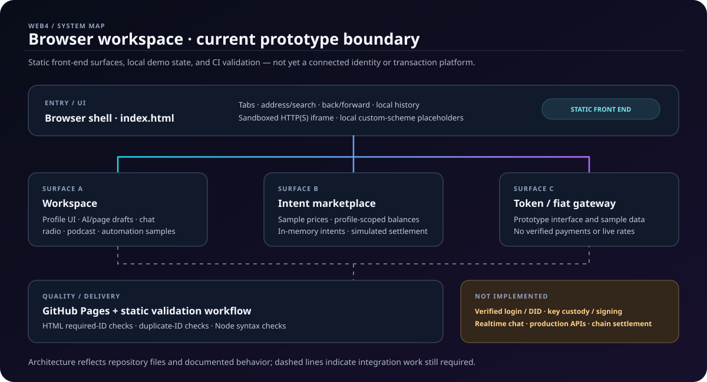

# Web4 Browser

<p align="center">
  <strong>A Web4-style browser workspace prototype</strong><br>
  Local-first interface experiments for navigation, profile context, generated-page drafts, media surfaces, and intent-centric tools.
</p>

<p align="center">
  <a href="https://github.com/web4hub/web4-browser/actions/workflows/validate-browser.yml"></a>
  <a href="https://github.com/web4hub/web4-browser/actions/workflows/static.yml"></a>
  <a href="https://github.com/web4hub/web4-browser/issues"></a>
</p>

**Live prototype:** [web4hub.github.io/web4-browser](https://web4hub.github.io/web4-browser/)

> **Honest status:** this repository is a static HTML/CSS/JavaScript prototype, not a production browser engine or a connected Web4 identity, wallet, chat, or payment platform. Treat simulated data as demo data.

## Architecture at a glance



```mermaid
flowchart TD
    A[Browser shell: index.html] --> B[Tabs and navigation]
    A --> C[Sandboxed HTTP(S) content]
    A --> D[Local profile context]
    D --> E[Workspace prototype]
    D --> F[Intent marketplace simulation]
    D --> G[Fiat and token gateway UI]
    E --> H[Drafts, chat and media samples]
    F --> I[Sample balances and prices]
    H -. no connected backend .-> J[(Future Web4 services)]
    I -. no wallet or chain .-> K[(Future transaction adapter)]
    L[GitHub Actions] --> M[HTML ID checks]
    L --> N[Inline JavaScript syntax checks]
```

## What is included

- Multi-tab browser shell with independent navigation history.
- Address entry, search fallback, back/forward/reload controls, and local bookmarks/history.
- HTTP(S) content displayed through a sandboxed iframe with a no-referrer policy; sites that disallow framing may not load.
- Local placeholders for custom Web4-style schemes and gateway-based `ipfs://CID` navigation.
- Prototype workspace surfaces for profile UI, AI and page-generation drafts, chat, radio, podcasts, and automation ideas.
- A separate intent-marketplace simulation with sample prices, in-memory profile balances, review actions, and clearly labeled simulated settlement.
- GitHub Actions checks for required HTML IDs, duplicate IDs, and inline JavaScript syntax.

## Feature and integration boundaries

| Area | Current status | What production requires |
|---|---|---|
| Browser navigation | Static prototype | Cross-browser testing, navigation hardening, accessibility and security review |
| Identity/profile | Local UI context | Trusted identity provider or DID resolver, server-side authorization, verified recovery |
| AI/page generation | Draft/demo surfaces | Explicit model/API integration, abuse controls, rate limits and publish consent |
| Chat/radio/podcasts | Prototype UI/samples | Messaging backend, media feeds/hosting, moderation and privacy controls |
| Automation | Draft/sample UI | Durable scheduler, scoped permissions, audit trail and cancellation |
| Currency/token surfaces | Simulated values | Trusted rate source, transaction-provider integration and applicable compliance review |
| Wallet/settlement | Not implemented | Secure wallet adapter, transaction preview, signing boundary and independent security review |
| Storage | Mostly in-memory/session UI | Authenticated persistence, retention policy, export/delete controls and encryption where appropriate |

Do not enter passwords, seed phrases, private keys, financial details, or other secrets into this prototype. A profile label is not verified identity; a demo fingerprint is not a cryptographic proof; a simulated approval is not a real transaction.

## Run locally

The current app is static and does not require a package install.

```bash
git clone https://github.com/web4hub/web4-browser.git
cd web4-browser
python3 -m http.server 8000
```

Open [http://localhost:8000](http://localhost:8000). You can also open `index.html` directly, although serving over HTTP is closer to the GitHub Pages environment.

## Validation

The repository's `.github/workflows/validate-browser.yml` workflow runs a Python HTML structure/ID check and Node.js syntax checks against inline scripts in the browser entry points.

```bash
python3 --version
node --version
```

For a local check, use the same workflow steps: confirm required IDs exist and are unique in `index.html`, `static/marketplace.html`, and `static/workspace.html`, extract each inline JavaScript block, and run `node --check` on each extracted script. These checks do not replace browser interaction, accessibility, dependency, or security tests.

## Visual roadmap: 5D workspace views

In this project, **“5D” means a product visualization concept, not literal fifth-dimensional physics**. A future interactive view can combine five user-facing axes:

1. **Space** — tabs, pages, panels, and navigation context.
2. **Time** — history, session transitions, and automation timelines.
3. **Identity context** — clearly labeled local profile selection and permission boundaries.
4. **Data layers** — page content, AI drafts, media, and intent state.
5. **Interaction** — selectable layers, filters, keyboard navigation, and state transitions.

Any implementation should remain responsive, keyboard-accessible, performant on mobile, and usable with reduced motion. The architecture SVG and Mermaid diagram above are documentation visuals, not a recording of a live 5D interface.

## GIF and video demos

A verified screen recording or animated GIF has **not yet been committed**. Do not mistake the architecture diagram for a product demo. Once the core interactions pass browser-based tests, capture a short, authentic walkthrough covering navigation, workspace state, and the simulated marketplace; include captions, alt text, and a reduced-motion/static alternative.

## Security and privacy notes

- Only HTTP(S) URLs are navigated directly; custom schemes are represented locally rather than silently sent through an arbitrary proxy.
- Framed pages are sandboxed and receive no referrer, but an iframe is not a full browser security boundary.
- Profile switching changes local UI state only; it does not isolate storage or network traffic, authenticate a DID, or provide anonymity.
- No production wallet connection, secure key custody, transaction signing, zero-knowledge proof generation, or blockchain settlement is implemented.
- Treat all hard-coded prices, balances, and exchange outcomes as illustrative sample data.

See [platform architecture](docs/WEB4_PLATFORM_ARCHITECTURE.md), [identity and wallet lifecycle](docs/web4-identity-wallet-lifecycle.md), and [AI safety and verification notes](docs/AISVS.md) for the current design boundaries.

## Contributing

Please open an issue for significant design changes and submit focused pull requests. Include the behavior changed, manual test steps, relevant screenshots or recordings when available, and the exact validation results. Do not commit secrets or present unimplemented integrations as working features.

## License

No license is currently declared in this repository. Until one is added, do not assume the code is available under an open-source license.
